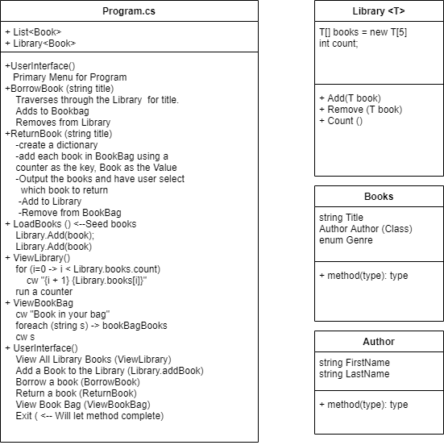

# Project Name

**Author**: JP Jones & Krystian Francuz-Harris
**Version**: 1.0.0

## Overview
Provides a Simulation of checking out and returning a book to a library.  Books can be checked out and placed in a Book Bag.  They can also
return the book that will remove it from the Book Bag and return it to the library.

## Getting Started
Running the application will take you to a text-based console where you can make choices that correspond to interacting
with a library.

## Example

## Architecture
Utilizes Generic Class and List manipulation to utilize the data.

## Change Log
